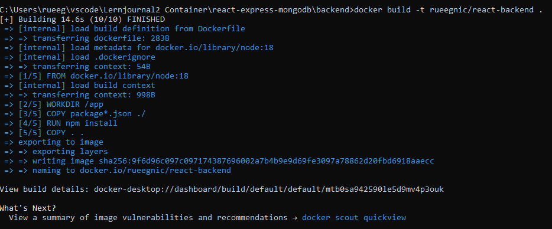
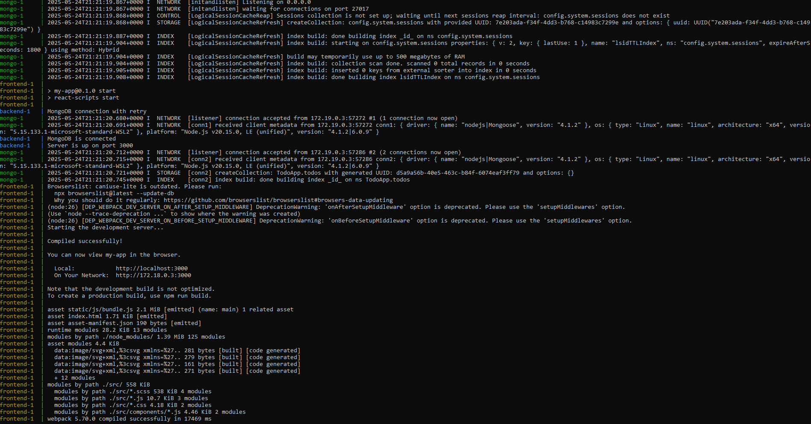
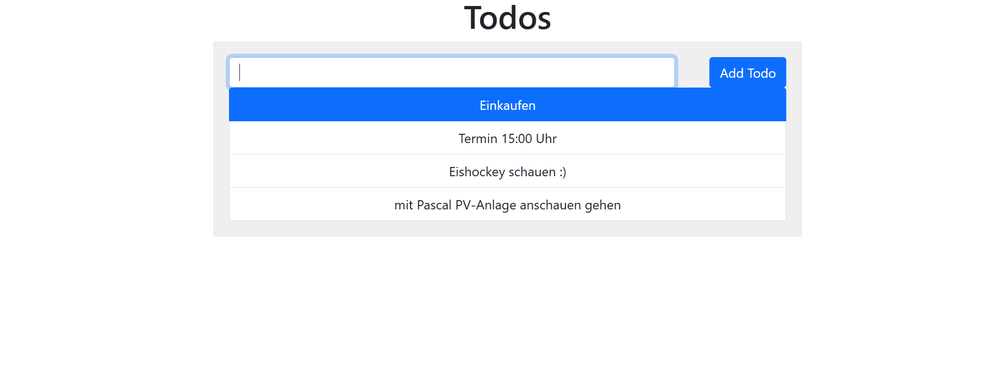
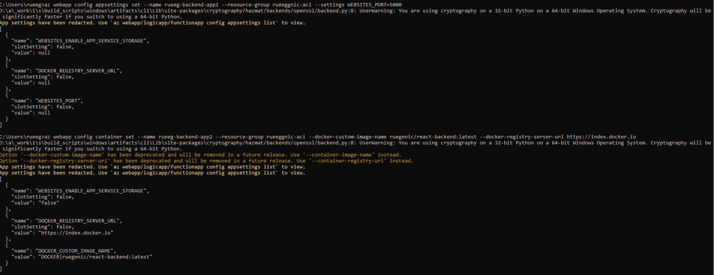
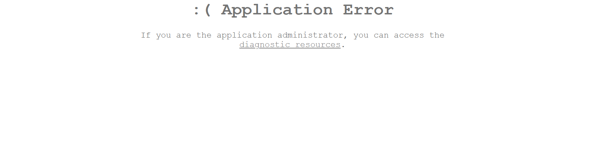

# Lernjournal 2 Container

## Docker Web-Applikation

### Verwendete Docker Images

| | Bitte ausfüllen |
| -------- | ------- |
| Image 1 | react-backend |
| Image 1 | https://hub.docker.com/r/rueegnic/react-backend |
| Image 2 | nicht verwendet |
| Image 2 | nicht verwendet |
| ... | ... |
| Docker Compose | https://github.com/rueegnic/react-backend |

### Dokumentation manuelles Deployment

Ich habe die lokale Entwicklungsumgebung mit Docker installiert. Der Projektordner habe ich mit dem Dockerfile ergänzt. Dann habe ich lokal das Docker Image erstellt mit dem Tag rueegnic/react-backend. Dann habe ich das erstellte Image zu Docker Hub gepusht. Von Docker Hub habe ich es dann auf Azure deployed. Hier kommt auch ein erfolgreicher Deploy, aber ich glaube ich habe irgendwelche falsche Daten genommen. Die Seite wird zwar erreicht, in der Darstellung ist aber etwas falsch.

### Dokumentation Docker-Compose Deployment

Lokale Entwicklungsumgebung mit Docker und Docker Compose installiert. Projekt enthält docker-compose.yml. Docker compose mit docker-compose up -- build gestartet. Das was über den Localhost Port 3000 erreichbar.

## Deployment ML-App

### Variante und Repository

| Gewähltes Beispiel | Bitte ausfüllen |
| -------- | ------- |
| onnx-sentiment-analysis | Nein |
| onnx-image-classification | Ja |
| Repo URL Fork | https://hub.docker.com/r/rueegnic/react-backend |
| Docker Hub URL | https://hub.docker.com/r/rueegnic/react-backend |

### Dokumentation Deployment Azure Web App

Schritte:

Docker-Image lokal erstellt mit:
<pre lang="md">docker build -t ruegenic/react-backend .</pre>

Docker-Image gepusht auf Docker Hub:
<pre lang="md">docker push ruegenic/react-backend</pre>

Ressourcengruppe erstellt:
<pre lang="md">az group create --name rueeggnic-aci --location switzerlandnorth

App Service Plan (Linux, B1) erstellt:
az appservice plan create --name rueeg-plan --resource-group rueeggnic-aci --sku B1 --is-linux

Web App erstellt:
az webapp create --resource-group rueeggnic-aci --plan rueeg-plan --name rueeg-backend-app2 --deployment-container-image-name ruegenic/react-backend:latest

Azure Port-Weiterleitung konfiguriert:
az webapp config appsettings set --name rueeg-backend-app2 --resource-group rueeggnic-aci --settings WEBSITES_PORT=5000

Container-Image gesetzt:
az webapp config container set --name rueeg-backend-app2 --resource-group rueeggnic-aci --docker-custom-image-name ruegenic/react-backend:latest --docker-registry-server-url https://index.docker.io
</pre>

Anwendung aufrufbar unter (sofern erfolgreich gestartet):
https://rueeg-backend-app2.azurewebsites.net

Wie erwähnt, hat eigentlich das Deployment komplett funktioniert, jedoch zeigte Azure einen Fehler an. Ich bin mir nicht sicher, ob es daran liegt, dass ich den falschen Plan genommen habe, weil da hatte ich ziemlich Probleme welche kostenfrei und welche nicht kostenfrei waren.

