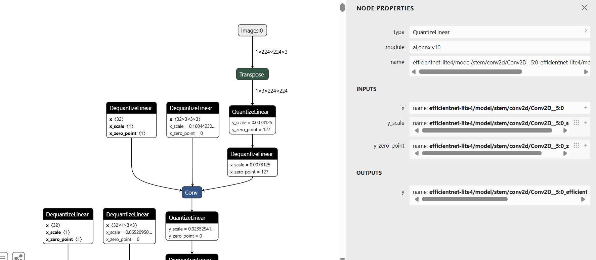
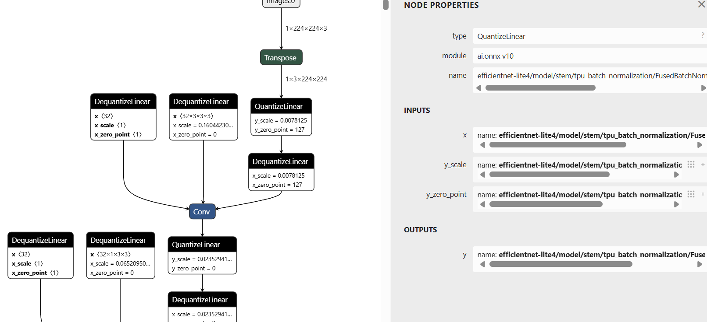
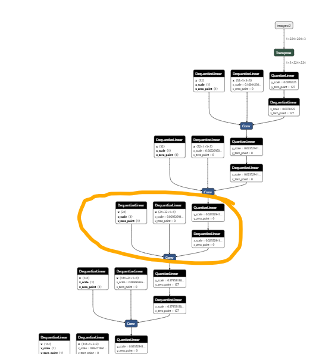
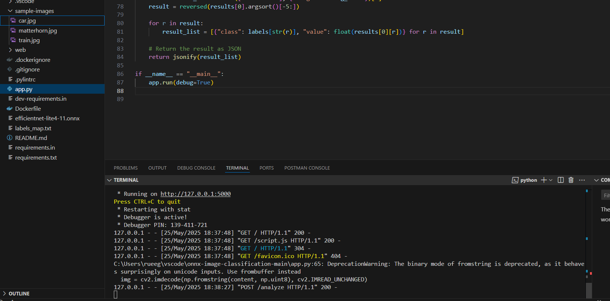
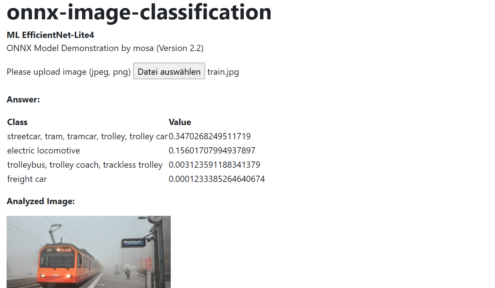
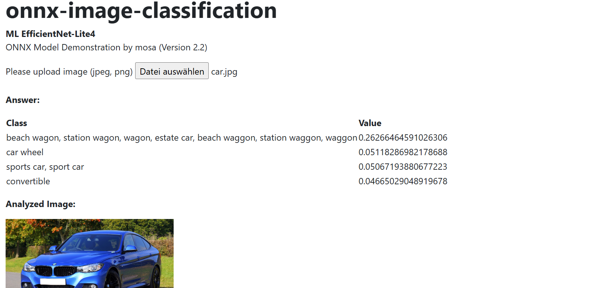
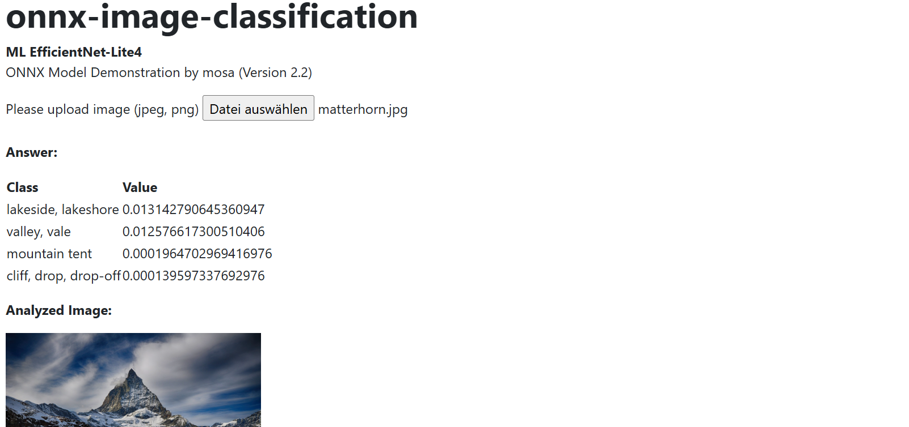
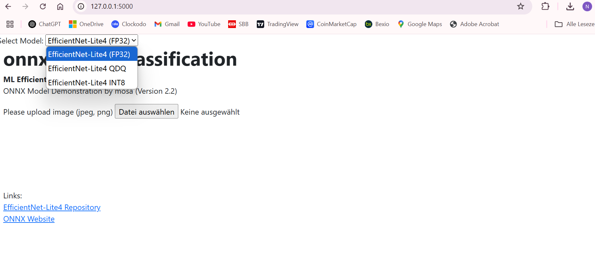

# Lernjournal 3 ONNX

## Übersicht

| | Bitte ausfüllen |
| -------- | ------- |
| ONNX Modell für Analyse (Netron) | https://github.com/onnx/models/blob/main/validated/vision/classification/efficientnet-lite4/model/efficientnet-lite4-11-qdq.onnx |
| onnx-image-classification Fork (EfficientNet-Lite) | https://github.com/rueeggnic/onnx-image-classification |

## Dokumentation ONNX Analyse

## Layer 1

Im Rahmen dieser Analyse wurde das quantisierte ONNX-Modell EfficientNet-Lite4-11-qdq mit dem Tool Netron geöffnet und im Detail untersucht. Ziel war es, den Aufbau eines ressourcenschonenden Modells zu verstehen, das für den Einsatz auf mobilen oder eingebetteten Systemen optimiert ist. Dazu wurden exemplarisch drei Layer analysiert und ihre Funktion im Kontext des Modells erläutert.

Der erste untersuchte Layer ist Transpose. Dieser Layer bringt die Eingabedaten vom klassischen NHWC-Format (Height × Width × Channels) in das von ONNX bevorzugte NCHW-Format (Channels × Height × Width). Dieser Schritt ist notwendig, da viele Operationen in ONNX – wie z. B. Convolution – dieses Datenformat voraussetzen. Die Tensorform ändert sich dabei von (1 × 224 × 224 × 3) auf (1 × 3 × 224 × 224).

Anschliessend wurde der Layer QuantizeLinear betrachtet. Dieser Layer konvertiert Floating-Point-Werte in quantisierte Ganzzahlen, typischerweise INT8, um die Inferenz effizienter zu gestalten. Der Layer verwendet dafür einen Skalierungsfaktor (y_scale) und einen Offset (y_zero_point). In der analysierten Modellversion waren dies beispielhaft y_scale = 0.0078125 und y_zero_point = 127. Diese Transformation spart Speicher und Rechenleistung, was besonders bei mobilen Anwendungen entscheidend ist.

Ein weiterer zentraler Layer im Modell ist DequantizeLinear, der in der analysierten Struktur mehrfach vorkommt – unter anderem im Zusammenhang mit Depthwise-Convolution-Blöcken. Dieser Layer hebt die Quantisierung der Bias-Werte wieder auf, bevor sie in der eigentlichen Convolution verwendet werden. Die ursprünglichen, quantisierten Werte werden mithilfe eines Skalierungsfaktors und eines Offsets in Gleitkommazahlen umgerechnet. Das ist notwendig, da Bias-Werte und Filtergewichte häufig quantisiert gespeichert werden, für Berechnungen aber in höherer Präzision (z. B. FP32) benötigt werden. Insbesondere bei depthwise_conv2d handelt es sich um eine Form der Convolution, bei der jeder Eingangskanal separat verarbeitet wird – eine Technik, die in EfficientNet zur Reduktion des Rechenaufwands verwendet wird.

Durch die Analyse dieser Layer konnte ein gutes Verständnis für die Struktur und die Optimierungen von quantisierten ONNX-Modellen gewonnen werden. Die Visualisierung in Netron hilft dabei, komplexe Abläufe wie das Zusammenspiel von Quantisierung, Dequantisierung und Faltungsschritten nachvollziehbar darzustellen.

## Layer 2

In einem frühen Abschnitt des EfficientNet-Lite4-Modells lässt sich ein typisches Verarbeitungsschema quantisierter Netze erkennen: Zuerst werden die Eingabedaten, Filtergewichte und Bias-Werte mit DequantizeLinear in Gleitkommazahlen konvertiert. Diese Umrechnung ist nötig, da die darauffolgende Faltung (Conv) mit Float-Werten durchgeführt wird. Der Conv-Layer extrahiert dabei mit mehreren Filtern erste Bildmerkmale. Im Anschluss werden die Ergebnisse durch QuantizeLinear erneut in INT8-Werte umgerechnet, um die Effizienz des Modells beizubehalten. Dieses Muster ist typisch für quantisierte Modelle und zeigt, wie ONNX eine Balance zwischen Genauigkeit und Performance ermöglicht.

## vertiefte Struktur

Im Abschnitt blocks_0 beginnt die eigentliche vertiefte Struktur des Modells. Innerhalb dieses Blocks werden mehrere Operationen kombiniert: Zunächst erfolgt eine DequantizeLinear-Operation auf die Eingabedaten und die Gewichte. Danach folgt eine depthwise_conv2d, die pro Kanal eine eigene Faltung durchführt – typisch für MobileNet-ähnliche Architekturen. Das Ergebnis wird durch eine BatchNormalization stabilisiert und anschliessend durch QuantizeLinear wieder in INT8 überführt. Solche Blocks wiederholen sich mehrfach im Modell, wobei sich Filteranzahl, Kernelgrössen und Skalierungswerte jeweils ändern.

## Dokumentation onnx-image-classification

Im Rahmen der Aufgabe wurde das bereitgestellte ONNX-Modell efficientnet-lite4-11.onnx in eine lokale Flask-Webapplikation eingebunden. Die Anwendung wurde über ein vorhandenes GitHub-Repository (Fork) heruntergeladen, lokal geöffnet und erfolgreich mit Python gestartet. Nach dem Starten der App über python app.py lief das System unter http://127.0.0.1:5000 im Browser.

Über die Weboberfläche konnte ein Testbild (train.jpg) hochgeladen werden. Nach dem Absenden des Bildes wurde es serverseitig mit onnxruntime geladen und klassifiziert. Das Modell lieferte dabei eine Top-1-Vorhersage „streetcar, tram, tramcar, trolley, trolley car“ mit einer Confidence von ca. 0.35. Weitere Vorhersagen mit absteigender Wahrscheinlichkeit wurden ebenfalls angezeigt (z. B. „electric locomotive“ mit ~0.15).

Das Ergebnis zeigt, dass das Modell trotz niedriger Top-1-Confidence (unter 50 %) inhaltlich korrekt zwischen ähnlichen Klassen unterscheiden konnte – alle Prediction-Ergebnisse bezogen sich nachvollziehbar auf das dargestellte Schienenfahrzeug.

Die Einbindung des ONNX-Modells in eine Flask-Oberfläche verdeutlicht, wie maschinelles Lernen mit vortrainierten Modellen einfach lokal getestet werden kann. Die Nutzung von onnxruntime erlaubt dabei eine schnelle Inferenz ohne Abhängigkeit zu externen GPU-Diensten oder Frameworks wie TensorFlow oder PyTorch.

Zur Evaluierung der Klassifikationsleistung des EfficientNet-Lite4-Modells wurden drei verschiedene Bilder getestet: ein Zug (train.jpg), ein Auto (car.jpg) und ein Landschaftsbild (matterhorn.jpg). Die Klassifikation erfolgte über das lokal gestartete Flask-Webinterface mit dem ONNX-Modell efficientnet-lite4-11.onnx.

Das beste Ergebnis lieferte das Bild train.jpg, das mit hoher Wahrscheinlichkeit der Klasse
„streetcar, tram, tramcar, trolley, trolley car“ zugeordnet wurde. Die Top-1-Prediction lag hier bei über 0.34, gefolgt von sinnvollen Alternativen wie „electric locomotive“.

Das Bild car.jpg wurde mit deutlich geringerer Sicherheit (Top-1: ~0.26) der Klasse „station wagon“ zugeordnet. Auch hier sind die Alternativklassen (z. B. „car wheel“, „sports car“) plausibel, allerdings zeigt sich eine breitere Streuung der Wahrscheinlichkeiten, was auf Unsicherheit im Modell schliessen lässt.

Das Landschaftsbild matterhorn.jpg wurde am schlechtesten erkannt. Die Top-1-Klasse war „lakeside, lakeshore“ mit nur ~0.013, dicht gefolgt von „valley“ und „cliff“. Dies deutet darauf hin, dass das Modell für natürliche Szenen ohne dominante Objekte weniger geeignet ist – was nachvollziehbar ist, da EfficientNet ursprünglich auf Objekterkennung in der ImageNet-Domäne trainiert wurde.

## Vergleich von drei Modellen

Für den Modellvergleich wurden drei Varianten von EfficientNet-Lite4 verwendet, die im ONNX Model Zoo verfügbar sind. Das erste Modell war die ursprüngliche FP32-Version (efficientnet-lite4-11.onnx), die mit voller Gleitkomma-Genauigkeit arbeitet und als Referenzmodell dient. Als zweite Variante wurde das quantisierte QDQ-Modell (efficientnet-lite4-11-qdq.onnx) getestet, das durch das Einfügen von Dequantize- und Quantize-Operationen Effizienzgewinne bei nur minimalem Genauigkeitsverlust ermöglicht. Ergänzend dazu kam ein INT8-Modell (efficientnet-lite4-11-int8.onnx) zum Einsatz, das vollständig mit 8-Bit-Ganzzahlen arbeitet und besonders speicher- und rechenoptimiert ist. Alle drei Modelle wurden über dasselbe Flask-Webinterface getestet, indem das jeweils zu verwendende Modell über ein Dropdown-Menü ausgewählt wurde. Dadurch konnten direkte Vergleiche der Vorhersagen und der Konfidenzwerte für dieselben Eingabebilder durchgeführt werden.

Änderungen im Code:

Index.html
<pre><code>
<label for="model">Select Model:</label>
<select name="model">
  <option value="fp32">EfficientNet-Lite4 (FP32)</option>
  <option value="qdq">EfficientNet-Lite4 QDQ</option>
  <option value="int8">EfficientNet-Lite4 INT8</option>
</select>
</code></pre>

app.py:
<pre><code>
def analyze():
    # Modellwahl
    model_choice = request.form.get("model", "fp32")
    model_paths = {
        "fp32": "efficientnet-lite4-11.onnx",
        "qdq": "efficientnet-lite4-11-qdq.onnx",
        "int8": "efficientnet-lite4-11-int8.onnx"
    }
    ort_session = onnxruntime.InferenceSession(model_paths[model_choice])
</code></pre>

